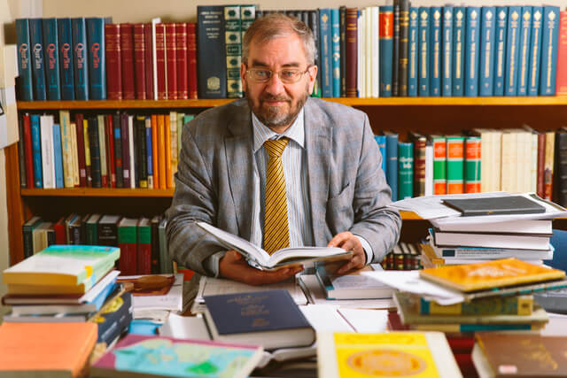
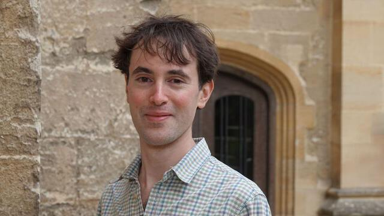
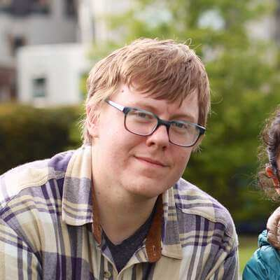

Further participants will be added to this list as they confirm their
attendance. We are still looking for a few more researchers to take part, and we
have a bit of funding to facilitate this. If you are interested or know someone
who might be a good fit, please get in touch with
[Theodore Beers](https://www.theobeers.com/links).

## Prof. Dr. Jaakko Hämeen-Anttila

Professor of Arabic and Islamic Studies, University of Edinburgh
([profile](https://www.ed.ac.uk/profile/jaakko-hameen-anttila))

## Dr. James White

Departmental Lecturer in Persian Literature, Faculty of Oriental Studies,
University of Oxford
([Academia.edu page](https://oxford.academia.edu/JamesWhite))

## Dr. Yoones Dehghani-Farsani

Department Member, Orientabteilung, Staatsbibliothek zu Berlin -- Preußischer
Kulturbesitz
([Academia.edu page](https://gesamtkatalogderwiegendrucke.academia.edu/YoonesDehghaniFarsani))

## Dr. Theodore Beers

Postdoctoral Research Fellow, ERC project AnonymClassic, Freie Universität
Berlin ([homepage](https://www.theobeers.com/))
