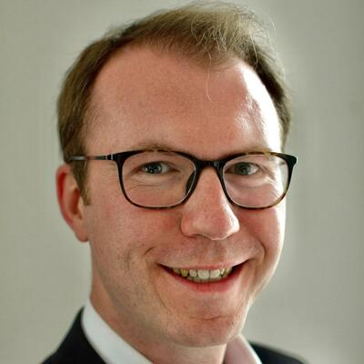

Participants are listed alphabetically by surname (except that the host is
last). The Dr. title is used where applicable, but other titles are omitted.
Please direct any questions or inquiries to
[Theodore Beers](https://www.theobeers.com/links).

## Dr. Vahid Behmardi

Associate Professor of Arabic and Persian Literature, Lebanese American
University

_Dr. Behmardi will be presenting remotely._

## Dr. Philip Bockholt

Assistant Professor, Westfälische Wilhelms-Universität Münster

## Dr. Yoones Dehghani Farsani

Department Member, Orientabteilung, Staatsbibliothek zu Berlin -- Preußischer
Kulturbesitz
([Academia.edu page](https://gesamtkatalogderwiegendrucke.academia.edu/YoonesDehghaniFarsani))

## Dr. Jaakko Hämeen-Anttila

Professor of Arabic and Islamic Studies, University of Edinburgh
([profile](https://www.ed.ac.uk/profile/jaakko-hameen-anttila))

## Khouloud Khalfallah

PhD candidate, Freie Universität Berlin

## Dr. Pegah Shahbaz

Postdoctoral Fellow, Asian Institute, Munk School of Global Affairs and Public
Policy, University of Toronto
([profile](https://munkschool.utoronto.ca/profile/shahbaz-pegah-shahbaz/))

_Dr. Shahbaz will be presenting remotely._

## Tobias Sick

PhD candidate, Westfälische Wilhelms-Universität Münster

## Dr. James White

Departmental Lecturer in Persian Literature, Faculty of Oriental Studies,
University of Oxford
([Academia.edu page](https://oxford.academia.edu/JamesWhite))

## Dr. Mohsen Zakeri

Faculty Member, Arabic and Islamic Studies Department, Georg-August-Universität
Göttingen

## Dr. Theodore Beers

Postdoctoral Research Fellow, ERC project AnonymClassic, Freie Universität
Berlin ([homepage](https://www.theobeers.com/))
