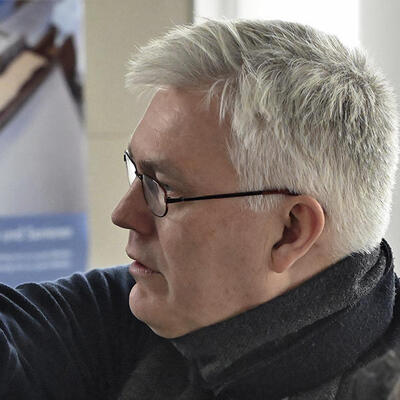

Participants are listed alphabetically by surname. Please direct any questions
or inquiries to [Theodore Beers](https://www.theobeers.com/links).

## Presenters

### Dr. Theodore Beers

Postdoctoral Research Fellow, ERC project AnonymClassic, Freie Universität
Berlin ([homepage](https://www.theobeers.com/))

### Prof. Dr. Vahid Behmardi

Associate Professor of Arabic and Persian Literature, Lebanese American
University

_Dr. Behmardi will be presenting remotely._

### Prof. Dr. Philip Bockholt

Assistant Professor, Westfälische Wilhelms-Universität Münster

### Dr. Yoones Dehghani Farsani

Department Member, Orientabteilung, Staatsbibliothek zu Berlin -- Preußischer
Kulturbesitz
([Academia.edu page](https://gesamtkatalogderwiegendrucke.academia.edu/YoonesDehghaniFarsani))

### Prof. Dr. Jaakko Hämeen-Anttila

Professor of Arabic and Islamic Studies, University of Edinburgh
([profile](https://www.ed.ac.uk/profile/jaakko-hameen-anttila))

### Khouloud Khalfallah

PhD candidate, Freie Universität Berlin

### Dr. Pegah Shahbaz

Postdoctoral Fellow, Asian Institute, Munk School of Global Affairs and Public
Policy, University of Toronto
([profile](https://munkschool.utoronto.ca/profile/shahbaz-pegah-shahbaz/))

_Dr. Shahbaz will be presenting remotely._

### Tobias Sick

PhD candidate, Westfälische Wilhelms-Universität Münster

### Dr. James White

Departmental Lecturer in Persian Literature, Faculty of Oriental Studies,
University of Oxford
([Academia.edu page](https://oxford.academia.edu/JamesWhite))

### Prof. Dr. Mohsen Zakeri

Faculty Member, Arabic and Islamic Studies Department, Georg-August-Universität
Göttingen

## Session chairs & others

### Dr. Jan van Ginkel

Senior Postdoctoral Research Fellow, Seminar for Semitic and Arabic Studies,
Freie Universität Berlin
([profile](https://www.geschkult.fu-berlin.de/en/e/semiarab/arabistik/Seminar/Mitarbeiterinnen-und-Mitarbeiter/Wissenschaftliche-Mitarbeiterinnen-und-Mitarbeiter-_Drittmittel_/van-ginkel/))

### Prof. Dr. Beatrice Gründler

Professor of Arabic Studies, Freie Universität Berlin
([profile](https://www.geschkult.fu-berlin.de/en/e/semiarab/arabistik/Seminar/Mitarbeiterinnen-und-Mitarbeiter/Professuren/Gruendler/))

### Dr. Johannes Stephan

Postdoctoral Research Fellow, ERC project AnonymClassic, Freie Universität
Berlin
([profile](https://www.geschkult.fu-berlin.de/en/e/semiarab/arabistik/Seminar/Mitarbeiterinnen-und-Mitarbeiter/Wissenschaftliche-Mitarbeiterinnen-und-Mitarbeiter-_Drittmittel_/stephan/))

### Prof. Dr. Isabel Toral

Director, Berlin Graduate School of Muslim Cultures and Societies, Freie
Universität Berlin
([profile](https://www.geschkult.fu-berlin.de/en/e/semiarab/arabistik/Seminar/Mitarbeiterinnen-und-Mitarbeiter/Professuren/toral/))
